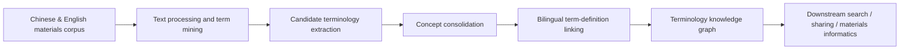
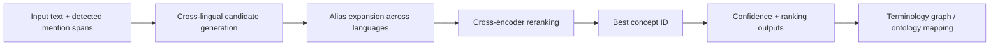
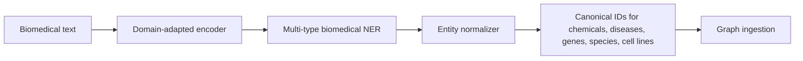
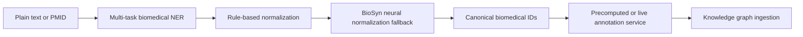
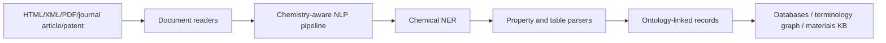
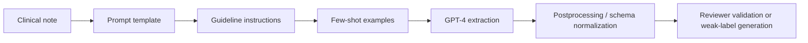
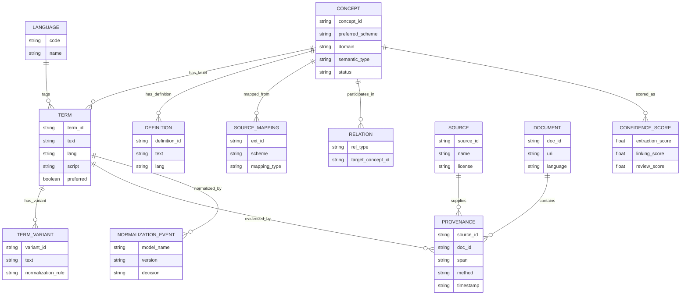

# Multilingual Term Extraction and Terminology Graph Construction in Chemistry and Medicine

## Executive summary

For multilingual chemistry and medical terminology work, the strongest free building blocks are not a single end-to-end system but a **stack**: open multilingual termbases and parallel resources for lexical coverage, strong NER and normalization models for extraction, and a concept-centric graph model for storage and governance. Among the most useful free resources, **IATE** offers downloadable multilingual terminology in the 24 official EU languages plus Latin, with reuse authorized if the source is acknowledged; **WIPO Pearl** provides validated scientific and technical terminology in 10 languages through a portal and API; **DGT-TM** offers professionally translated sentence-aligned EU text in 24 languages with reuse allowed under the European Commission reuse notice; **MANTRA** provides a multilingual biomedical concept-recognition gold standard in English, French, German, Spanish, and Dutch under GPL-3.0; **ParaPat** contributes large patent-parallel data in 74 language pairs; **Wikidata** provides multilingual labels and identifiers under CC0; and **ChEBI** provides a manually curated open chemical ontology under CC BY 4.0. PubChem is extremely valuable as a free chemical reference database and API, but it is not, by itself, a multilingual terminology system. citeturn8search1turn36view1turn38view0turn38view1turn35view0turn39search1turn39search6turn40search2turn37view3turn37view0turn10search2turn11search0

The technical literature shows a clear pattern: **true multilingual end-to-end extraction-plus-normalization systems remain relatively scarce**, especially in chemistry. The best multilingual progress is stronger in **medical entity normalization** than in multilingual chemistry NER. The most convincing cross-lingual pipeline in the sources reviewed is **xMEN**, which improves state of the art on medical entity normalization across several European languages using cross-lingual candidate generation and cross-encoder re-ranking. In contrast, many of the highest-performing biomedical and chemical NER tools remain **English-first**, such as **HunFlair2**, **BERN2**, and **ChemDataExtractor’s** newer chemical NER stack. This means that in production, multilingual chemistry/medicine systems usually combine multilingual lexical resources, multilingual encoders such as **mBERT/XLM-R**, cross-lingual normalization, and language-specific or translated extraction components rather than relying on one universal model. citeturn20view0turn22search8turn20view1turn30view0turn33search1turn14search2turn18search2

On the LLM side, the evidence is mixed but useful. Prompted GPT-style systems can become competitive for **relaxed-match** clinical NER, but in the reviewed studies they still trail strong supervised domain models on exact-match span accuracy. Instruction-tuned biomedical LLMs such as **BioNER-LLaMA** narrow that gap and, in the reported experiments, outperform few-shot GPT-4 by substantial margins on biomedical NER datasets. For **graph construction**, LLMs are best used as **relation proposal engines, ontology-extension suggesters, weak-label generators, and RAG-supported validators**, not as the only canonical source of truth. The chemistry KG system **CEAR** is a good example: it links extracted roles back to ChEBI, keeps provenance to source papers, and acknowledges that reliable recall measurement still requires expert annotation. citeturn28view0turn20view3turn20view5

The most robust architecture for a multilingual chemistry/medical terminology graph is therefore a **concept-first graph** with language-tagged labels, aliases, source-specific mappings, provenance, and confidence. In practice, the best design is usually **dual-format**: maintain a standards-friendly representation in **SKOS/RDF or TBX** for interchange and governance, and project it into a **property graph** such as Neo4j for operational querying, graph analytics, and application serving. Human review remains essential for synonym collapsing, false-friend detection, safety-critical medical normalization, and ontology-extension approval. citeturn9search0turn9search3turn9search1turn9search7turn9search5turn9search20

## Landscape and key findings

The table below separates the landscape into the solutions most relevant to a multilingual terminology-graph program. It emphasizes what each system is actually good at, because the literature often conflates **term extraction**, **entity linking**, **knowledge-base curation**, and **graph construction** even though they are different engineering problems. citeturn20view0turn21search1turn20view1turn30view0turn24view3turn28view0turn20view3turn20view5

| Solution | Domain focus | Multilingual coverage | What it does best | NER / LLM role | Graph / KB role | Free status and constraints | Bottom-line assessment |
|---|---|---|---|---|---|---|---|
| **MGED-KG** citeturn21search1 | Materials terminology adjacent to chemistry | Chinese, English | Term-centric KG creation from corpus | NLP-driven term extraction; not principally LLM-first in paper | Builds bilingual terminology KG with 8,660 terms and explanations | Research paper and open-access article; not a turnkey product | Strong template for bilingual terminology-graph design, but not a ready-made chemistry/medicine extractor |
| **xMEN** citeturn20view0turn24view0 | Medical normalization | Benchmarked on English, Spanish, French, German, Dutch | Cross-lingual concept normalization | Transformer-based generate-and-rank with cross-encoder reranking | Links mentions to standard terminologies; plugs into upstream NER | Apache-2.0 toolkit; depends on target KB licenses such as SNOMED/UMLS | Best-reviewed open solution here for multilingual medical normalization |
| **HunFlair2** citeturn22search5turn20view1 | Biomedical literature | English-first extraction on biomedical corpora | Strong out-of-domain NER+NEN robustness | Domain-adapted LM with NER and linking | Useful as English biomedical extraction backbone | Open/free via Flair ecosystem; verify exact downstream redistribution terms | Excellent extraction core, but not itself a multilingual program |
| **BERN2** citeturn30view0turn24view2 | Biomedical literature | English-first | Fast large-scale biomedical NER/NEN | Multi-task NER + hybrid rule/neural normalization | Good annotation layer before graph ingestion | BSD-2-Clause repo; hosted service has rate limits | Very strong for English biomedical bulk tagging; multilingual gap remains |
| **ChemDataExtractor 2 + single-model chemical NER** citeturn24view3turn33search1turn34search6 | Chemistry, materials | Primarily English | Chemical entity and property extraction from papers, tables, patents | Rule-based extraction plus BERT/SciBERT-era chemical NER | Auto-populates ontology-like records and databases | MIT licensed | One of the best free chemistry extraction frameworks, but multilingual support is limited |
| **Prompt-engineered GPT-4 clinical NER** citeturn28view0 | Clinical NER | Paper evaluated in English | Low-annotation NER bootstrap | Prompt engineering, few-shot, guideline prompting | Useful for weak labels, review assistance, hard examples | Closed-model dependency and API cost/PHI governance issues | Valuable accelerator, not ideal as sole production extractor |
| **BioNER-LLaMA** citeturn20view3turn29search0turn29search6 | Biomedical NER | Biomedical datasets in paper; model base is general Llama | Instruction-tuned generative NER | LLM fine-tuning for generation-style NER | Good for flexible schema transfer | Research code; Llama-family license constraints matter | Strong sign that instruction-tuned open LLMs are becoming useful extraction components |
| **CEAR** citeturn20view5 | Chemistry roles and KG extension | English chemistry literature | LLM-assisted KG extension linked to ChEBI | LLM prompts for relation/role discovery | Explicit KG construction with provenance to papers | Research prototype; evaluation still incomplete | Promising pattern for graph extension, but still immature for regulated deployment |
| **John Snow Labs healthcare NLP** citeturn18search3turn18search2turn17search4 | Clinical / biomedical product | Varies by model; examples in 7–8 languages | Production pipelines, resolvers, code mapping | Transformer NER, rule components, entity resolvers, some zero-shot modules | Good operational stack for KB-linked doc pipelines | Commercial/licensed product | Best industry stack in this set for productionization, but not free/open |
| **Azure Text Analytics for health** citeturn19search2turn19search17 | Clinical NLP product | English, German, French, Italian, Spanish, Portuguese, Hebrew | Managed entity extraction, linking, FHIR output | Transformer-style managed service | Easy EHR/FHIR integration | Paid cloud service | Practical managed option, but limited transparency and domain adaptation control |
| **IATE / WIPO Pearl / DGT-TM / Wikidata** citeturn8search1turn36view1turn38view1turn40search2 | Terminology and multilingual lexical resources | Broad multilingual coverage | Canonical labels, definitions, aligned text, multilingual metadata | No NER by themselves | Essential lexical and concept layer for graph construction | Mostly free, but reuse and attribution terms differ | These are foundational resources, not extractors |

A central conclusion from the literature is that **multilingual terminology graph quality depends more on concept normalization and governance than on NER alone**. NER finds spans; high-value terminology graphs require stable identifiers, cross-language alias management, fine-grained provenance, and conflict resolution across sources. The reviewed systems that perform best operationally are the ones that separate those concerns rather than trying to solve everything in one model. citeturn20view0turn30view0turn21search1turn9search0turn9search1

## Representative solutions

### MGED-KG

**Short description.** MGED-KG is one of the clearest recent examples of a **terminology-first graph** rather than a document-classification system. Although it is in materials science rather than medicine, it is directly relevant because it shows how bilingual scientific terminology can be extracted, normalized into concepts, and represented as a reusable graph. The paper reports that MGED-KG is a Chinese-English terminology KG containing **8,660 terms and explanations**. citeturn21search1

| Aspect | Details |
|---|---|
| Languages supported | Chinese and English. citeturn21search1 |
| Datasets / sources used | Text corpus for materials terminology; graph is literature-derived. citeturn21search1 |
| NER / LLM components | NLP-based term extraction; the article positions it as automatically constructed from corpus, not as an LLM-native system. citeturn21search1 |
| Evaluation result | The paper’s headline result is graph scale and coverage: 8,660 terms with explanations in a Chinese-English KG. citeturn21search1 |
| License / usage constraints | Open-access paper; operational reuse depends on any released data artifacts rather than article access alone. citeturn21search1 |
| Strengths | Concept-centric design; bilingual, terminology-oriented; directly useful as a graph schema reference. citeturn21search1 |
| Weaknesses | Adjacent to chemistry, not clinical medicine; not a production-ready multilingual NER service. citeturn21search1 |
| Key source | Scientific Data article. citeturn21search1 |

### xMEN

**Short description.** xMEN is the strongest open cross-lingual medical normalization system in the reviewed set. Its design is explicitly modular: upstream NER provides mention spans, then xMEN performs multilingual candidate generation and trainable reranking into a target terminology or ontology. It was evaluated across **English, Spanish, French, German, and Dutch** benchmark datasets and reported state-of-the-art results in most settings. citeturn20view0turn24view0

| Aspect | Details |
|---|---|
| Languages supported | Evaluated across English, Spanish, French, German, and Dutch; designed for broader cross-lingual use when aliases exist in some language, often English. citeturn20view0 |
| Datasets / sources used | Integrates with BigBIO and benchmark datasets; paper describes weak supervision from machine translation and projection for low-resource settings. citeturn20view0turn24view0 |
| NER / LLM components | Transformer-based generate-and-rank pipeline with cross-lingual candidate generation and trainable cross-encoder reranking; meant to integrate with existing NER pipelines. citeturn20view0turn24view0 |
| Evaluation result | Paper reports improvements over prior state of the art across diverse multilingual benchmark datasets and explicitly positions the method as effective even without labeled target-language data. citeturn20view0 |
| License / usage constraints | Apache-2.0 for the toolkit; actual target terminologies may impose separate restrictions. citeturn24view0 |
| Strengths | Best open reviewed cross-lingual normalization architecture in this set; excellent fit for multilingual term graphs. citeturn20view0turn24view0 |
| Weaknesses | Requires upstream mention detection; performance still degrades on complex multi-word mentions. citeturn20view0 |
| Key sources | JAMIA Open paper and GitHub repository. citeturn20view0turn24view0 |

### HunFlair2

**Short description.** HunFlair2 is a strong biomedical extraction backbone, especially when you need **entity recognition plus normalization** that still performs well on unseen corpora. It is not the answer to multilingual extraction by itself, but it is highly relevant because many multilingual medical graph programs still standardize through English abstracts, translated corpora, or English-centric biomedical knowledge bases. citeturn22search5turn22search8turn20view1

| Aspect | Details |
|---|---|
| Languages supported | English-first biomedical text processing in the reviewed official docs and paper. citeturn22search5turn22search8 |
| Datasets / sources used | Cross-corpus biomedical benchmarks including MedMentions, tmVar v3, and BioID, among others in the cross-corpus evaluation. citeturn20view1 |
| NER / LLM components | Replaces earlier recurrent character-LM components with **LinkBERT** and adds normalization support. citeturn22search8 |
| Evaluation result | In the cross-corpus end-to-end evaluation, HunFlair2 achieved the best average mention-level micro-F1 among compared tools, with **59.97 average micro-F1**, ahead of PTC at 54.75 and BERN2 at 37.56 in that benchmark setup. citeturn20view1 |
| License / usage constraints | HunFlair2 is distributed through the free/open Flair ecosystem; confirm exact package and model redistribution terms for enterprise packaging. citeturn23search3turn22search5 |
| Strengths | Excellent cross-corpus robustness; does NER and linking; good default biomedical backbone. citeturn20view1turn22search5 |
| Weaknesses | English-first; multilingual operation usually requires adjacent translation or cross-lingual normalization layers. citeturn22search5turn20view1 |
| Key sources | Bioinformatics paper and Flair docs. citeturn20view1turn22search5turn22search8 |

### BERN2

**Short description.** BERN2 remains one of the most practical biomedical annotation engines if you need broad biomedical typing and fast bulk annotation. It supports **nine entity types** and combines multi-task NER with hybrid normalization. That makes it highly relevant for graph construction from English biomedical literature and as a component in multilingual systems that pivot through English or parallel corpora. citeturn30view0turn24view2

| Aspect | Details |
|---|---|
| Languages supported | English-first biomedical text and PubMed-centric workflows in paper and repo. citeturn30view0turn24view2 |
| Datasets / sources used | BC2GM, NCBI-disease, BC4CHEMD, tmVar2, Linnaeus, JNLPBA for NER; BC2GN and BC5CDR for normalization. citeturn30view0 |
| NER / LLM components | Multi-task NER with a shared biomedical LM backbone plus task-specific layers; hybrid NEN using rule-based mapping and BioSyn-based neural fallback. citeturn30view0 |
| Evaluation result | On NER, BERN2 reports F1 of **92.8** on BC4CHEMD, **88.6** on NCBI-disease, **83.7** on BC2GM, and **92.7** on Linnaeus. On NEN, it reports **95.9** accuracy on BC2GN gene/protein, **93.9** on BC5CDR disease, and **96.6** on BC5CDR chemical. It also reports faster annotation than prior tools, with **0.33 sec/abstract** for plain text and **0.03 sec/abstract** for PMID mode in the table shown. citeturn30view0 |
| License / usage constraints | BSD-2-Clause repo; hosted service repo notes a web-service limit of **300 requests per 100 seconds** per user and documents server resource expectations. citeturn24view2 |
| Strengths | Fast, broad biomedical coverage, strong benchmark results, practical API/server setup. citeturn30view0turn24view2 |
| Weaknesses | Not genuinely multilingual in the reviewed implementation; can require substantial infrastructure for self-hosting. citeturn24view2turn30view0 |
| Key sources | Bioinformatics paper and GitHub repo. citeturn30view0turn24view2 |

### ChemDataExtractor and its single-model chemical NER stack

**Short description.** ChemDataExtractor is still one of the most important free systems for chemistry text mining because it couples document processing, chemistry-aware parsing, tables, and ontology-like record generation. The newer “single model for organic and inorganic chemical NER” work is particularly important because it narrows the historical gap between organic-chemistry and materials/inorganic vocabularies. citeturn24view3turn34search7turn33search1

| Aspect | Details |
|---|---|
| Languages supported | Primarily English in official docs and reviewed model paper. citeturn24view3turn34search7 |
| Datasets / sources used | Chemical NER work reports results on **CHEMDNER** and **Matscholar**, aiming to unify organic and inorganic recognition. citeturn33search1 |
| NER / LLM components | Official docs describe a chemistry-aware NLP pipeline; the 2022 model paper reports a BERT-based chemical NER system available in ChemDataExtractor 2.1, and the ACS snippet states it uses **SciBERT/BERT architecture**. citeturn24view3turn14search2turn14search5 |
| Evaluation result | Reported headline F1 scores are **89.7** on CHEMDNER and **88.0** on Matscholar. citeturn33search0turn33search1 |
| License / usage constraints | MIT licensed. citeturn24view3 |
| Strengths | Best-in-class free chemistry extraction framework in this review; handles documents, tables, and ontology-linked extraction; highly reusable for KB construction. citeturn24view3turn34search7 |
| Weaknesses | Multilingual chemistry support is still weak; many patterns and pretrained components remain English-oriented. citeturn24view3turn33search1 |
| Key sources | GitHub repo, docs, and JCIM paper abstract snippets. citeturn24view3turn34search6turn33search1 |

### Prompt-engineered GPT-4 for clinical NER

**Short description.** This line of work is important not because it beats supervised baselines outright, but because it shows where LLMs already help: rapid bootstrapping, guideline-conditioned extraction, few-shot adaptation, and human-review assistance. The reviewed JMIA study is one of the best primary evaluations of prompt-engineered LLMs for clinical NER. citeturn28view0

| Aspect | Details |
|---|---|
| Languages supported | Evaluated in English clinical tasks in the primary paper. citeturn28view0 |
| Datasets / sources used | MTSamples and VAERS clinical NER tasks. citeturn25search0turn28view0 |
| NER / LLM components | GPT-3.5 and GPT-4 with task description, guideline prompts, error-analysis instructions, and few-shot annotated examples. citeturn25search0turn28view0 |
| Evaluation result | With the full prompt framework and 5 examples, **GPT-4** reached relaxed-match F1 of **0.861** on MTSamples and **0.736** on VAERS, while **BioClinicalBERT** remained higher at **0.901** and **0.802** respectively. citeturn28view0 |
| License / usage constraints | Closed-model dependency; handling PHI/clinical text raises governance, privacy, and vendor lock-in issues beyond the paper’s model-comparison scope. The paper itself demonstrates feasibility, not an open deployable model artifact. citeturn28view0turn25search0 |
| Strengths | Good for low-label scenarios, schema transfer, and weak-label generation. citeturn28view0 |
| Weaknesses | Worse exact-boundary control than strong supervised models; closed-model operational constraints. citeturn28view0 |
| Key source | JMIA paper. citeturn26view0turn28view0 |

### BioNER-LLaMA and LLM-assisted KG construction

**Short description.** Two recent trends matter here. First, **BioNER-LLaMA** shows that instruction-tuned open LLMs can become respectable biomedical extractors, frequently outperforming pure few-shot prompting. Second, systems such as **CEAR** and **BioStrataKG** illustrate how LLMs help with graph assembly and ontology extension. The combination is promising, but still not an excuse to skip canonical normalization and expert review. citeturn20view3turn20view5turn12search2

| Aspect | Details |
|---|---|
| Languages supported | BioNER-LLaMA paper is biomedical NER-focused rather than explicitly multilingual in evaluation; CEAR is chemistry-literature focused; multilingual support must be layered in through KBs, prompts, and retrieval resources. citeturn20view3turn20view5 |
| Datasets / sources used | BioNER-LLaMA was evaluated on disease, chemical, and gene NER datasets; CEAR links chemistry-literature role extraction to ChEBI; BioStrataKG uses LLMs over biomedical articles to build a biomedical stratified KG. citeturn20view3turn20view5turn12search2 |
| NER / LLM components | Instruction tuning for generation-style NER in BioNER-LLaMA; prompt-based relation/role extraction in CEAR; LLM-centric knowledge mining in BioStrataKG. citeturn20view3turn20view5turn12search2 |
| Evaluation result | BioNER-LLaMA reports **5%–30%** higher F1 than few-shot GPT-4 across the tested biomedical NER datasets and claims performance comparable to fine-tuned PubMedBERT-class models. CEAR explicitly says reliable recall is **not yet available** and that expert annotation is still needed to evaluate prompts and settings. citeturn20view3turn20view5 |
| License / usage constraints | BioNER-LLaMA research code is public, but Llama-family model use is governed by Meta’s community license. CEAR is a research prototype rather than a packaged open platform. citeturn29search0turn29search6turn20view5 |
| Strengths | Strong adaptability, ontology extension, weak-label generation, and relation proposal. citeturn20view3turn20view5 |
| Weaknesses | Hallucination risk, unstable boundaries, and immature evaluation for graph extraction. citeturn20view5turn28view0 |
| Key sources | Bioinformatics paper, repository, CEAR paper, and BioStrataKG article. citeturn20view3turn29search0turn20view5turn12search2 |

### Selected evaluation snapshots

| Solution | Metric | Key reported result | Source |
|---|---|---|---|
| HunFlair2 | End-to-end cross-corpus mention-level micro-F1 | **59.97** average, best among compared tools in the reported table | citeturn20view1 |
| BERN2 | NER F1 on BC4CHEMD | **92.8** | citeturn30view0 |
| BERN2 | NEN accuracy on BC2GN | **95.9** | citeturn30view0 |
| ChemDataExtractor model | Chemical NER F1 | **89.7** on CHEMDNER; **88.0** on Matscholar | citeturn33search0turn33search1 |
| GPT-4 prompt-engineered clinical NER | Relaxed-match F1 | **0.861** on MTSamples; **0.736** on VAERS | citeturn28view0 |
| BioClinicalBERT baseline in same study | Relaxed-match F1 | **0.901** on MTSamples; **0.802** on VAERS | citeturn28view0 |
| BioNER-LLaMA | Relative gain over few-shot GPT-4 | **5%–30% higher F1** across tested biomedical NER datasets | citeturn20view3 |
| CEAR | KG evaluation maturity | Reliable recall **not yet reported**; manual annotation underway | citeturn20view5 |

## Datasets, knowledge bases, glossaries, and parallel resources

A multilingual chemistry/medical terminology graph will stand or fall on the quality of its lexical and conceptual inputs. The resources below are the highest-value free assets from the reviewed sources for multilingual coverage, normalization, translation alignment, and concept grounding. citeturn8search1turn36view1turn38view1turn35view0turn39search1turn37view0turn40search2

| Resource | What it is | Languages / coverage | Best use in a terminology graph | Access mode | Free / license status | Key caveat |
|---|---|---|---|---|---|---|
| **ChEBI** citeturn10search0turn36view3turn37view0 | Curated chemical ontology and database | Primarily concept-centric chemistry resource; multilingual aliasing is limited compared with general termbanks | Canonical chemistry IDs, hierarchy, synonyms, roles, RDF/OWL structure | Downloads, REST API, FTP, ontology files | CC BY 4.0; open-access | Not a broad multilingual lexicon on its own |
| **PubChem** citeturn10search2turn10search15turn37view1 | Very large free chemical information database | Global coverage of compounds and synonyms; not primarily multilingual terminology | Synonym expansion, compound grounding, chemical metadata enrichment | Web, downloads, PUG-REST | Official site presents it as freely accessible | Synonym data are useful, but language normalization remains an extra step |
| **WIPO Pearl** citeturn36view1turn13search2turn13search22 | Validated scientific and technical terminology portal | **10 languages**: Arabic, Chinese, English, French, German, Japanese, Korean, Portuguese, Russian, Spanish | High-quality multilingual terminology, especially technical/patent language; reliability scoring | Portal + API | Free public use; API available | In official materials reviewed here, it behaves more like a portal/API than an openly downloadable bulk termbase |
| **IATE** citeturn8search1turn37view2 | EU terminology management system | **24 official EU languages + Latin** | Broad multilingual term inventory; useful seed termbase across medicine, chemistry, law, IP | Search, Search API/widget, downloadable TBX/CSV | Reuse authorized with source acknowledgment | EU-domain bias; concept depth varies by subject |
| **MANTRA GSC** citeturn35view0 | Multilingual biomedical concept-recognition gold standard | English, French, German, Spanish, Dutch | Training/evaluation for multilingual biomedical mention detection and normalization | GitHub corpus download | GPL-3.0 | Valuable benchmark, but relatively small by modern LLM standards |
| **ParaPat** citeturn39search1turn39search6turn39search3 | Parallel patent corpus from Google Patents | **74 language pairs**, more than **68 million** parallel sentences | Parallel terminology induction, weak supervision, patent-domain alignment | Paper + dataset pointers / Figshare | Paper snippet reports **CC BY-NC** | Excellent for mining term equivalence, but patentese is stylistically distinct from clinical prose |
| **DGT-TM** citeturn38view0turn38view1 | EU professional translation memory | **24 official EU languages**; 276 language pairs / 552 directions on the technical page | Sentence alignment, terminology consistency, multilingual representation learning | Dataset download + API | Reuse authorized if source acknowledged | Legislative domain; terminology is formal and EU-specific |
| **Wikidata** citeturn40search2turn37view3 | Multilingual collaborative knowledge base | Multilingual labels, aliases, and statements at web scale | Cross-source linking, multilingual label store, external IDs, graph hub | SPARQL, REST, Action API, dumps | CC0 / public domain dedication | Quality is variable by entity and property; biomedical completeness is uneven |
| **MMedC / MMedBench** citeturn16search0turn16academia9 | Multilingual medical corpus and LLM benchmark | **6 main languages**, 25.5B-token corpus | Domain adaptation and evaluation for multilingual medical LLMs | Research paper + project repo | Research/open model ecosystem | Not a terminology KB, but very valuable for multilingual medical LLM adaptation |
| **NLM-Chem** citeturn33search5 | Full-text chemical NER benchmark | English biomedical full text | Chemical NER/NEN benchmarking and training | Data/API via NCBI resources per article | Public research resource | Not multilingual |
| **GOSyBench / ChEMU** citeturn14search10turn33search6 | Chemistry KG extraction / NER benchmarks | English chemistry/patent text | Evaluating reaction/event extraction and KG extraction | Research benchmark releases | Research use | Good benchmark additions for chemistry relation extraction, less about multilinguality |

One important practical point is that the “multilingual” resources split into two different families. **Termbases and translation memories** such as IATE, WIPO Pearl, DGT-TM, MANTRA, and ParaPat are best for **language coverage** and term equivalence. **Ontology/knowledge-base resources** such as ChEBI, PubChem, and Wikidata are best for **concept identity and graph structure**. A production terminology graph needs both families. citeturn8search1turn36view1turn38view1turn35view0turn39search1turn37view0turn10search2turn40search2

For chemistry specifically, **ChEBI + PubChem + patent-domain multilingual resources** is the most attractive free combination. For medicine, **xMEN-compatible biomedical terminologies + MANTRA + IATE + Wikidata + multilingual medical corpora** form the more natural base. In both domains, Wikidata is useful as an interoperable multilingual spine because it offers multilingual labels, standard identifiers, query interfaces, and a permissive public-domain license. citeturn37view0turn10search2turn39search1turn35view0turn37view2turn40search2turn37view3

## Pipelines, models, normalization, and graph design

A robust multilingual extraction stack usually follows six stages: **document ingestion**, **language identification and segmentation**, **candidate terminology detection**, **NER**, **concept normalization/linking**, and **graph insertion with provenance/confidence**. This decomposition matters because the best model family is different at each stage. Dictionary/rule methods still work well for high-precision seed harvesting; CRF and BiLSTM-CRF remain useful baselines, especially when labels are scarce or deterministic features matter; transformer families such as **mBERT** and **XLM-R** are now the default multilingual encoders; and domain-adapted biomedical/chemical models typically win when enough in-domain supervision exists. xMEN’s generate-and-rank normalization pattern and BERN2’s hybrid normalization architecture illustrate this modular approach well. citeturn20view0turn30view0turn28view0turn15search12turn19search8

```mermaid
flowchart LR
    A[Documents: papers, patents, labels, EHRs, glossaries] --> B[OCR-free text ingestion where possible]
    B --> C[Language ID and sentence segmentation]
    C --> D[Dictionary / regex / candidate term mining]
    D --> E[NER model]
    E --> F[Candidate concepts from ChEBI / UMLS / Wikidata / IATE / WIPO]
    F --> G[Cross-lingual linker and reranker]
    G --> H[Concept merge and deduplication]
    H --> I[Human review on low-confidence items]
    I --> J[SKOS/TBX/RDF master graph]
    J --> K[Neo4j property-graph projection]
    K --> L[Search, translation assist, QA, RAG, analytics]
```

The main NER model families are best thought of as a spectrum rather than replacements for one another. In the reviewed clinical NER comparison, a **CRF** still remained competitive enough to beat GPT-3.5 on exact-match F1 in one setting, while **BioClinicalBERT** led overall and GPT-4 performed best among prompted LLMs under relaxed matching. In biomedicine more broadly, **HunFlair2** and **BERN2** show how domain-adapted transformer systems dominate contemporary supervised extraction. In chemistry, the ChemDataExtractor 2.1-era model reported strong performance across both CHEMDNER and Matscholar, which is especially important because materials and inorganic subdomains often differ from biomedical chemical nomenclature. citeturn28view0turn20view1turn30view0turn33search1

LLMs play four roles that are genuinely useful in terminology-graph programs. The first is **prompted extraction** for low-label bootstrapping. The second is **retrieval-augmented generation**, where the model generates candidates while constrained by ChEBI/UMLS/Wikidata/termbase retrieval. The third is **instruction tuning or fine-tuning**, as in BioNER-LLaMA, to convert extraction into a generation problem with better schema flexibility. The fourth is **in-context review assistance**, where the model proposes merges, identifies likely false cognates, or drafts relation candidates for humans to approve. The reviewed sources support these roles; they do not support using LLMs as a fully autonomous canonicalizer in chemistry or medicine. citeturn28view0turn20view3turn20view5turn12search2

For normalization, the most reliable pattern is **generate-and-rank**. Candidate generation should use exact aliases, normalized string variants, transliterations where relevant, multilingual termbank equivalents, and embedding retrieval. Candidate ranking should then combine lexical overlap, context-aware cross-encoders, source trust, and ontology neighborhood checks. xMEN’s cross-lingual candidate generation and re-ranking is one of the best published examples of this pattern. BERN2’s hybrid rule-plus-neural normalization is another, particularly for biomedical English. citeturn20view0turn30view0

For graph construction, **SKOS** is attractive for multilingual labels, broader/narrower relations, mappings, and interoperability. **TBX** is attractive for terminology exchange and termbase interoperability. **RDF** is attractive for knowledge-base publishing and linked-data integration. **Neo4j** is attractive as an operational execution layer because it handles nodes, relationships, and properties directly and supports large-scale graph imports and APIs. In practice, a standards-first **SKOS/TBX/RDF master layer** plus a **Neo4j projection** provides the best balance between standards compliance and application performance. citeturn9search0turn9search3turn9search18turn9search1turn9search7turn9search5turn9search8

A high-quality graph also needs **provenance** and **confidence** that are first-class objects, not just metadata scraps. The best practice is to preserve source dataset, document ID, sentence or character span, extraction model name/version, matching score, reviewer disposition, and timestamp. CEAR explicitly highlights source-paper, page, and character-position provenance, and even points toward richer RDF-star style modeling for future versions. Wikidata is also a useful reminder that graph statements and sources should be separable but connected. citeturn20view5turn40search2

Human-in-the-loop review is most valuable at three points. First, at **ontology/termbase alignment**, where experts approve which cross-source identifiers are actually the same concept. Second, at **low-confidence merges**, where multilingual aliases may be near-synonyms rather than true synonyms. Third, at **LLM-proposed relations and new concept suggestions**, where the literature still shows weak recall guarantees and non-trivial hallucination risk. The CEAR authors explicitly acknowledge that reliable recall still needs expert annotation, and the GPT clinical NER paper shows exact-boundary issues even when relaxed-match performance looks good. citeturn20view5turn28view0

## Evaluation, licensing, and deployment

Evaluation should be split across four layers: span detection, concept normalization, end-to-end extraction-and-linking, and graph quality. The literature reviewed here most frequently uses **precision, recall, and F1** for NER; **accuracy** or micro-F1 for normalization; **mention-level micro-F1** for end-to-end biomedical recognition-plus-linking; and **manual precision / expert validation** for KG construction. Graph-specific recall is often underreported because gold KG creation is expensive. citeturn30view0turn20view1turn28view0turn20view5

| Layer | Typical metrics | Typical benchmarks in reviewed sources | Practical note |
|---|---|---|---|
| Mention detection / NER | Precision, Recall, F1; exact vs relaxed match | CHEMDNER, BC4CHEMD, NCBI-disease, BC2GM, JNLPBA, Linnaeus, MTSamples, VAERS, MANTRA-derived tasks citeturn33search1turn30view0turn28view0turn35view0 | Exact match matters if graph nodes are span-grounded; relaxed match is often too generous for production |
| Concept normalization | Accuracy, micro-F1, recall@k, ranking metrics | BC2GN, BC5CDR, xMEN multilingual benchmarks citeturn30view0turn20view0 | In terminology systems, normalization is usually more critical than raw span F1 |
| End-to-end extraction + linking | Mention-level micro-F1 | HunFlair2 cross-corpus evaluation citeturn20view1 | Best single operational metric for document-to-graph pipelines |
| KG construction | Manual precision, relation accuracy, provenance completeness, curation acceptance rate | CEAR, BioStrataKG-style systems citeturn20view5turn12search2 | Treat relation recall claims cautiously unless gold annotations exist |

Licensing is not a side issue. It is one of the main design constraints in multilingual terminology work. Some of the best multilingual resources are truly permissive, while others are free but attribution-bound, non-commercial, or attached to separate terminology licenses. The free/open picture from the reviewed sources is summarized below. citeturn37view0turn38view1turn35view0turn39search1turn40search2

| Resource / tool | License or reuse condition | Implication |
|---|---|---|
| ChEBI | CC BY 4.0. citeturn37view0 | Good for open graph publication if attribution is preserved |
| Wikidata | CC0 / Public Domain Dedication 1.0. citeturn40search2 | Excellent for open redistribution and reconciliation layers |
| IATE | Reuse authorized provided the source is acknowledged; download in TBX/CSV available. citeturn8search1 | Strong free resource for commercial/internal use with attribution |
| DGT-TM | Reuse authorized under European Commission reuse notice with source acknowledgment. citeturn38view1 | Highly usable for training and terminology mining |
| MANTRA GSC | GPL-3.0 repo. citeturn35view0 | Fine for research and compatible open workflows; less convenient for some proprietary redistribution patterns |
| ParaPat | LREC paper snippet reports CC BY-NC. citeturn39search1 | Excellent for research; non-commercial clause can complicate production training uses |
| xMEN | Apache-2.0. citeturn24view0 | Production-friendly toolkit license |
| BERN2 | BSD-2-Clause. citeturn24view2 | Production-friendly license |
| ChemDataExtractor | MIT. citeturn24view3 | Production-friendly license |
| BioNER-LLaMA stack | Research code public, but Llama-family models use Meta community license. citeturn29search0turn29search6 | Check commercial and redistribution conditions carefully |

On deployment, open-source and managed systems have very different profiles. **BERN2** publishes practical clues about scale, including local server expectations and an API limit. **xMEN** explicitly supports PyPI, Docker, FAISS/nmslib-backed indexing, and integration with external NER. **ChemDataExtractor** is easiest to self-host and modify, especially for chemistry-heavy corpora. **Azure Text Analytics for health** is operationally attractive when you need multilingual managed service and **FHIR output**, but it trades away transparency and custom normalization control. **John Snow Labs** looks strongest among industry offerings for production pipelines, especially because it combines multilingual NER releases, resolvers, and mapping layers, but it is not free/open software. citeturn24view2turn24view0turn24view3turn19search2turn19search17turn18search3turn17search4

| Deployment dimension | Open-source pattern | Managed / commercial pattern |
|---|---|---|
| API and bulk annotation | BERN2 self-hosting, xMEN + your own serving layer, ChemDataExtractor batch jobs. citeturn24view2turn24view0turn24view3 | Azure Text Analytics for health, John Snow Labs pipelines. citeturn19search2turn18search3 |
| Bulk ingestion of reference KBs | ChEBI downloads + REST; DGT-TM and IATE exports; Wikidata dumps/APIs. citeturn36view3turn38view1turn8search1turn37view3 | Usually abstracted away, but less customizable |
| Multilingual adaptation | Retrain mBERT/XLM-R models; integrate IATE/WIPO/DGT/MANTRA/ParaPat; use xMEN for normalization. citeturn20view0turn35view0turn39search1turn8search1turn36view1 | Vendor-supported only in listed languages/features |
| Governance and provenance | Easier to make provenance first-class in your graph | Often easier operationally, but provenance granularity may be opaque |
| Cost profile | Lower variable cost, higher engineering cost | Faster start, recurring service/license cost |

## Recommendations and research roadmap

The most defensible way to build a multilingual terminology graph for chemistry and medicine is to start with a **concept-centric, graph-native termbase** rather than with document translation alone. In practical terms, that means using **ChEBI and PubChem** for chemical grounding, **Wikidata** as a multilingual identifier bridge, **IATE** and **WIPO Pearl** as multilingual terminology seeds, **DGT-TM/ParaPat** for cross-lingual lexical induction, and **MANTRA** or similar multilingual biomedical gold data for evaluation. A graph built only from translated surface forms will drift; a graph built on stable concept IDs can tolerate translation variation. citeturn37view0turn10search2turn40search2turn8search1turn36view1turn38view1turn39search1turn35view0

For extraction, the recommended default is **hybrid rather than LLM-only**. Use high-precision dictionaries and multilingual termbases for candidate generation, transformer NER for mention detection, and a generate-and-rank normalizer like xMEN for multilingual medical concept linking. In chemistry, use ChemDataExtractor or a comparable extraction backbone for documents and tables, then resolve chemistry concepts into ChEBI/PubChem and only later let an LLM suggest missing relations or ontology extensions. The reviewed evidence is consistent on this point: LLMs help most when constrained by structured retrieval and human review. citeturn20view0turn24view3turn20view5turn28view0turn20view3

For storage and interchange, maintain a **master representation in SKOS/TBX/RDF**, with a **Neo4j projection** for product features such as semantic search, graph QA, multilingual lookup, translation assistance, synonym browsing, and graph-RAG. This avoids getting locked into one graph database while still giving you an operational layer for applications. citeturn9search0turn9search1turn9search5

### Suggested roadmap

The timeline below is an implementation estimate rather than a claim from a cited source. It assumes a small applied-research team and no target-language restrictions.

| Milestone | Scope | Typical effort |
|---|---|---|
| Discovery and source audit | Confirm domain scope, allowed licenses, target terminology schemes, and graph schema. Prioritize ChEBI, PubChem, Wikidata, IATE, WIPO Pearl, DGT-TM, MANTRA, ParaPat. | 2–4 weeks |
| Graph schema and seed ingestion | Create concept, term, alias, mapping, provenance, and confidence schema in SKOS/TBX/RDF, plus Neo4j projection. Ingest free seed resources. | 3–5 weeks |
| Baseline extraction pipeline | Language ID, candidate mining, rule/dictionary seed harvesting, English-first chemistry/biomedical NER, and xMEN-style normalization for medical concepts. | 4–8 weeks |
| Multilingual expansion | Train or fine-tune mBERT/XLM-R token classifiers on selected languages; mine parallel terminology from DGT-TM/ParaPat/WIPO/IATE alignments; add transliteration and alias generation. | 6–10 weeks |
| LLM augmentation | Add RAG-backed LLM review for low-confidence items, ontology-extension proposals, relation suggestions, and weak-label generation. | 3–6 weeks |
| Human review workflow | Reviewer UI, adjudication queues, confidence thresholds, approval states, provenance drill-down. | 3–5 weeks |
| Evaluation and release readiness | Span F1, normalization accuracy, end-to-end micro-F1, merge precision, graph consistency checks, license audit, API hardening. | 3–6 weeks |
| Production hardening | Batch orchestration, monitoring, versioned graph releases, rollback, source refreshes, bulk export APIs. | 4–8 weeks |

### Concise build recommendations

A good build sequence is:

| Priority | Recommendation | Why |
|---|---|---|
| Highest | Make **concept normalization** the center of the system | Most multilingual errors come from alias ambiguity, not span finding |
| Highest | Use **free termbases + ontologies together** | Language coverage and concept identity come from different sources |
| High | Keep **provenance and confidence** as first-class graph objects | Essential for curation, regulated use, and future retraining |
| High | Use LLMs for **proposal and review support**, not sole canonicalization | Best-aligned with the evidence reviewed here |
| High | Maintain **standards representation + property graph projection** | Best balance of interoperability and product performance |
| Medium | Treat English-first biomedical/chemical NER as **useful components, not complete multilingual solutions** | Today’s strongest extractors are still disproportionately English-centric |
| Medium | Start with **medical normalization** and **chemistry term grounding** before harder cross-lingual relation extraction | Faster path to a useful multilingual graph |

### Prioritized primary and official sources

| Category | Source |
|---|---|
| Multilingual normalization | xMEN paper and toolkit. citeturn20view0turn24view0 |
| Biomedical NER/NEN | HunFlair2 paper/docs and BERN2 paper/repo. citeturn20view1turn22search5turn30view0turn24view2 |
| Chemistry extraction | ChemDataExtractor repo/docs and JCIM chemical NER paper snippets. citeturn24view3turn34search7turn33search1 |
| LLM NER | JMIA prompt-engineering paper and BioNER-LLaMA paper/repo. citeturn28view0turn20view3turn29search0 |
| LLM KG construction | CEAR and BioStrataKG. citeturn20view5turn12search2 |
| Chemistry knowledge bases | ChEBI and PubChem official resources. citeturn10search0turn36view3turn10search2turn37view1 |
| Multilingual termbases | IATE and WIPO Pearl official pages. citeturn8search1turn37view2turn36view1turn13search2 |
| Parallel corpora | DGT-TM official pages, MANTRA repo, ParaPat paper. citeturn38view0turn38view1turn35view0turn39search1turn39search6 |
| Graph standards | SKOS, TBX, Neo4j, Wikidata official docs. citeturn9search0turn9search1turn9search5turn37view3turn40search2 |